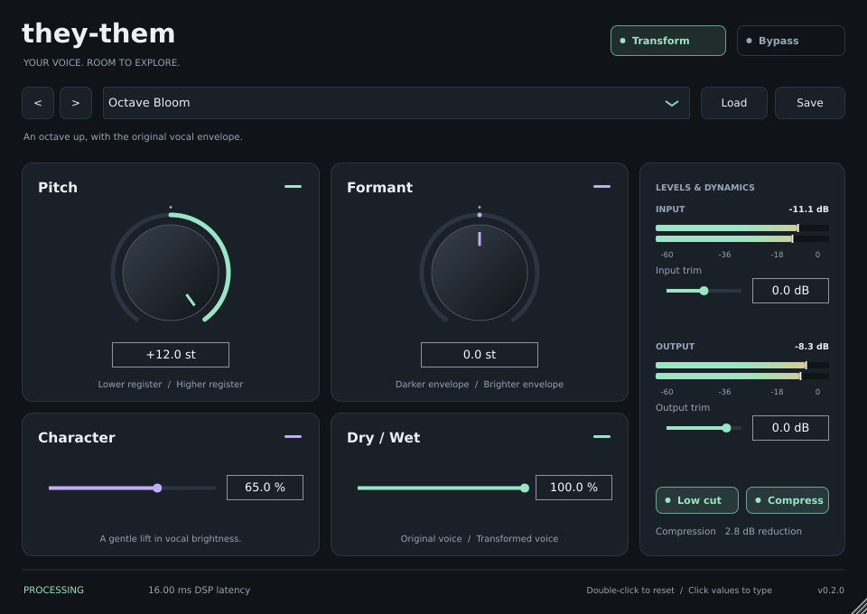

# they-them

A C++ vocal effect for live experiments and recording. Builds a
**VST3 audio effect** and a **standalone JUCE application** on Ubuntu.
Version **0.2.0** adds a resizable editor, eight factory voices, portable preset
files, stereo peak meters, and compression metering to the original pitch/formant
engine. No AI, cloud inference, models, accounts, telemetry, MIDI functionality,
or licensing service is used by the application.



The screenshot uses synthetic test audio. See [0.2.0 verification](docs/verification-0.2.0.md)
for the build, host, and editor checks and remaining listening work.

## Project status

Version 0.2.0 is a Linux development build with automated DSP, processor, preset,
metering, and editor checks. Live microphone/headphone acceptance remains pending;
the measured offline timings do not establish glitch-free live operation.

This repository contains source, tests, and documentation. Build outputs and raw
QA logs stay in ignored local directories. The verification pages are dated local
reports; their `build-next/qa/` evidence paths are not included in a fresh clone.

## Build on Ubuntu

Requirements: CMake 3.22+, a C++20-capable compiler, and the usual JUCE Linux development
packages. Install missing packages through Ubuntu's normal package manager:

```bash
sudo apt install build-essential cmake pkg-config ca-certificates \
  libasound2-dev libx11-dev libxext-dev libxinerama-dev libxrandr-dev \
  libxcursor-dev libfreetype-dev libfontconfig1-dev libgl1-mesa-dev

cmake -S . -B build -DCMAKE_BUILD_TYPE=Release
cmake --build build -j"$(nproc)"
ctest --test-dir build --output-on-failure
```

Use `-j2` instead on a machine with limited free memory; JUCE's GUI translation
units are large. The first configure also builds JUCE's `juceaide` helper and can
take several minutes. No global JUCE installation or Projucer project is needed.

CMake downloads **JUCE 9.0.2** at a pinned commit and verifies the archive's SHA256.
Network access is needed only for that first source acquisition. To use an
existing copy or configure offline, supply its source directory:

```bash
cmake -S . -B build -DCMAKE_BUILD_TYPE=Release \
  -DTHEY_THEM_JUCE_SOURCE_DIR=/path/to/JUCE-9.0.2
```

The small MIT DSP dependency is already in `ThirdParty/`. A DSP-only build
does not need JUCE or audio-device development packages:

```bash
cmake -S . -B build-dsp -DCMAKE_BUILD_TYPE=Release -DTHEY_THEM_BUILD_PLUGIN=OFF
cmake --build build-dsp -j2
ctest --test-dir build-dsp --output-on-failure
```

Build just one format with `--target TheyThem_Standalone` or
`--target TheyThem_VST3` after configuring. The default build also includes tests.

### Outputs

- VST3 bundle: `build/TheyThem_artefacts/Release/VST3/they-them.vst3`
- Linux x86-64 plugin binary inside the bundle:
  `Contents/x86_64-linux/they-them.so`
- Standalone: `build/TheyThem_artefacts/Release/Standalone/they-them`
- DSP test/measurement executable: `build/TheyThemDspTests`
- JUCE processor tests: `build/TheyThemPluginTests`
- Editor smoke/screenshot tool: `build/TheyThemEditorTests`

## First microphone test

1. Connect **headphones**, turn their level down, and disable the interface's
   direct monitor if you want to hear only the processed voice. Keep loudspeakers
   off for this test: output limiting cannot prevent acoustic feedback.
2. Run `./build/TheyThem_artefacts/Release/Standalone/they-them`.
3. Use JUCE's **Options > Audio/MIDI Settings** to select the input device,
   microphone input channel, output device, sample rate, and buffer size. The
   standard JUCE dialog's title mentions MIDI; this effect does not process MIDI.
4. Start with 48 kHz and 128 samples. JUCE initially mutes the input to prevent
   accidental feedback. After choosing the devices and checking headphone
   volume, use **Unmute Input**.
5. Speak, adjust Pitch and Formant independently, then try 64 samples if stable.
   If there are crackles, use 256 samples and check the audio system's xruns.

The default state is Pitch **+12 st**, Formant **0 st**, Character **65%**, Wet
**100%**, and input/output gain **0 dB**. Character adds a gentle formant offset;
set it to zero to evaluate pitch compensation with a neutral formant setting.
Stereo inputs remain separate. A mono input is transformed once and sent to both
stereo outputs, avoiding a duplicate spectral processing pass.
For a single microphone, enable only that input channel in the device dialog.

## Editor and presets

- Drag the Pitch and Formant knobs, or click their values to type an exact amount.
  Character, Dry / Wet, and trim controls work the same way. Double-click a control
  to restore its original default (Pitch returns to **+12 st**, not zero).
- Resize using the lower-right corner or the host window. The editor supports
  800 × 620 through 1440 × 1000; its initial size is 960 × 680.
- Browse the factory menu or use **< / >**. Factory voices preserve **input trim,
  output trim, and global bypass**. The menu shows **Custom settings** when voice
  controls no longer match a factory preset, including changes made by host automation.
- **Save** writes all ten controls to a readable `.ttvoice` preset. **Load** restores
  all ten controls, including trims and bypass. Files are portable between instances;
  no account or plugin-managed preset directory is needed. Use the `.ttvoice` extension.
- Invalid, incomplete, out-of-range, or unsupported preset files leave all controls
  unchanged. Saves use a temporary file and check the write before replacing an
  existing preset. File selection is asynchronous and cancels when the editor closes.
- Normal DAW session recall still uses the original parameter IDs and state root.
  Version 0.1.0 sessions remain compatible. Factory voices live in the editor menu;
  the plugin's host program count remains one.

| Factory voice | Pitch | Formant | Character | Wet |
| --- | ---: | ---: | ---: | ---: |
| Octave Bloom (original default) | +12 st | 0 st | 65% | 100% |
| Clean Slate | 0 st | 0 st | 0% | 100% |
| Soft Lift | +3 st | +1 st | 20% | 100% |
| Airlight | +5 st | +2 st | 35% | 100% |
| Low Tide | −4 st | −2 st | 0% | 100% |
| Deep Space | −12 st | −4 st | 0% | 100% |
| Small Hours | +7 st | +5 st | 40% | 100% |
| Parallel Glow | +12 st | +2 st | 35% | 35% |

All factory voices enable Low cut, Compress, and Transform. Clean Slate still runs
the spectral transform; use Transform off to hear only the utility effects.

### Read the meters

The two bars show the left and right channels. **Input** measures after input trim
and before Low cut/Compress. **Output** measures after mixing and output trim,
**before** the safety clamp, so an overload remains visible even when the returned
audio is bounded. In bypass, the meters follow the original input and delayed output.
For mono-to-stereo routing the second input bar is empty and both output bars match.

Meter peaks hold for one second, then fall smoothly. **CLIP** means the signal
reached or exceeded 0 dBFS and stays lit for two seconds; click a meter to clear its
peak hold and clip indication. These are sample-peak meters, not loudness or true-peak
measurements. Compression displays the compressor's peak gain reduction. The footer
distinguishes processing, bypass, and idle audio and shows DSP latency separately
from device latency.

## Load in Ardour

Copy the whole VST3 bundle to the standard per-user plugin directory:

```bash
mkdir -p ~/.vst3
cp -a build/TheyThem_artefacts/Release/VST3/they-them.vst3 ~/.vst3/
```

Rescan plugins in Ardour's Plugin Manager (or restart Ardour), then insert
**they-them** on an audio track. Select the microphone as the track input and
enable **input monitoring** in Ardour. Route the track to the headphone output.
Ardour controls devices, sample rate, and buffer size when using the VST3.
Avoid monitoring the microphone simultaneously through the interface's dry
monitor and the delayed plugin unless that blend is intentional.

## Controls and signal path

```text
Input gain → 80 Hz high-pass → gentle compressor
           → pitch + compensated formant transformation
           → latency-aligned dry/wet mix → output gain → sample safety clamp
```

| Control | Range | Default | Behavior |
| --- | --- | --- | --- |
| Pitch | −12 to +12 semitones, continuous | +12 | Changes musical pitch |
| Formant | −12 to +12 semitones, continuous | 0 | Shifts the spectral envelope independently of pitch |
| Character | 0–100% | 65% | Adds 0 to +2 semitones of conservative formant offset |
| Dry / Wet | 0–100% | 100% | Linear blend; dry path follows input gain and is delay-aligned |
| Input | −24 to +24 dB | 0 | Before the utility chain |
| Output | −48 to +12 dB | 0 | After dry/wet mixing |

High-pass, compressor, and transformation have separate enable switches. Global
Bypass (including host bypass) ignores the gains and effects and returns delayed
unity input within normal ±1 sample bounds; the final safety clamp remains active.
Bypass changes and continuous controls are smoothed over a 20 ms
time constant. This smoothing does not add audio lookahead.

The high-pass is a second-order 80 Hz Butterworth filter. Compression is linked
across stereo channels, 2:1 above −18 dBFS, with 10 ms attack, 100 ms release,
and no makeup gain. Dry is taken after input gain and before those utilities.
The output has a final finite-value/sample clamp to ±1; it is a last-resort
clipping guard, not a transparent limiter or a feedback suppressor.

## Algorithm, latency, and real-time operation

A persistent streaming adapter composes **stftPitchShift 2.0**'s deterministic
phase vocoder and cepstral envelope processing. It estimates a smooth spectral
envelope, removes it from the excitation, transposes the excitation, then restores
the independently shifted envelope. Pitch and formant share one analysis/synthesis
pipeline. The cepstral lifter is 1.5 ms; no pitch detector or voice classifier is
used. The upstream offline wrapper is not called from the audio callback.

The asymmetric window uses **4096 analysis samples, 256 synthesis samples, and a
64-sample hop**. Analysis uses past input, and upstream phase compensation is
retained. The host is told **768 samples** through `setLatencySamples()`; the UI
shows the corresponding **17.415 ms at 44.1 kHz / 16.000 ms at 48 kHz**. Neutral
transform impulse-peak measurements match that delay. This is a spectral effect:
small impulse energy arrives before the peak, and the neutral impulse has about
0.88% peak-amplitude ripple. Dry/wet alignment uses the measured peak delay.
See [current verification](docs/verification-0.2.0.md) and the
[original DSP measurements](docs/verification.md) for test results.

Dry, transformation bypass, and global bypass retain that same latency. Hardware
conversion, device buffers, audio-server routing, and other DAW effects add
further delay. The DSP impulse test is **not** a measurement of microphone-to-
headphone round-trip latency.

Buffers, FFT state, delay lines, and coefficients are prepared outside the audio
callback. The callback uses cached parameter atomics, fixed-size chunks, and
preallocated state. It performs no file/network operations, logging, mutex
locking, or heavyweight initialization. Automated tests instrument C++ heap
allocation/deallocation during processing and stress parameter changes. Offline
callback timing is diagnostic; it does not certify a real-time Linux scheduler.

## Tests and current limits

`ctest` checks parameter ranges/defaults, state round-trip and malformed state,
dry/wet math, utility/global/host bypass, mono/stereo behavior, silence/reset,
NaN/Inf recovery, gain bounds, reported versus measured DSP latency, and common
44.1/48 kHz rates with 64/128/256-sample buffers. The DSP executable additionally
reports synthetic-vowel pitch/envelope measurements and callback timing.

The processor tests also cover factory presets, host change notifications, complete
preset-file recall, corrupt-file rejection without partial changes, stereo/pre-clamp
meter accuracy, meter reset, and processing with zero C++ heap calls.

The editor smoke tool opens **no audio devices**. Run it from a graphical session
to exercise resizing, parameter attachments, preset selection, bypass, and repeated
editor reopening, and to save PNG renders of the actual editor:

```bash
./build/TheyThemEditorTests "$PWD/build/qa"
```

To include that graphical check in CTest, configure with
`-DTHEY_THEM_TEST_EDITOR=ON`. Leave it off for headless build jobs without a display.

- The analysis history spans 92.9 ms at 44.1 kHz / 85.3 ms at 48 kHz even though
  output peak delay is much shorter. Transients can smear; breathy/noisy input,
  consonants, and extreme shifts need listening tests.
- True stereo processing is CPU-heavy on the tested older laptop; some offline
  callback timings exceeded buffer deadlines. Prefer one microphone input and
  begin at 128 samples; use 256 if needed. No glitch-free live claim is made.
- Downward octave shifts showed up to 0.72% pure-tone frequency error in the
  measured cases; upward octaves were substantially more accurate.
- Formant correction is approximate; Character is a small timbral offset, not
  an identity or voice model. Pitch/formant changes cannot guarantee a particular
  perceived identity.
- Large boosts can hit the sample clamp and audibly distort; reduce input/output
  gain if necessary. A hot microphone preamp can clip before the plugin receives
  any samples.
- Only Linux is exercised in this pass. No installers, other
  plugin formats, or custom Linux audio backend are included.
- Saved parameters are supported through normal host/JUCE state handling.
- See [verification](docs/verification-0.2.0.md) for exactly what was exercised and
  what still requires a person with a microphone and headphones.

## Licenses

stftPitchShift 2.0 is **MIT**; its notice
and exact revision are in [ThirdParty/README.md](ThirdParty/README.md).
JUCE 9.0.2 is **AGPLv3 or commercial**, not permissively licensed. The included
Steinberg VST3 SDK is **MIT**. Do not assume that the MIT DSP dependency license
makes the combined plugin MIT: distribution must comply with the selected JUCE
license. This MVP does not assign a distribution license to the original code.
